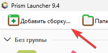
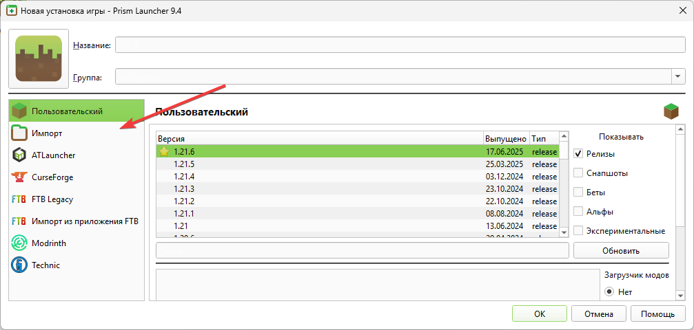
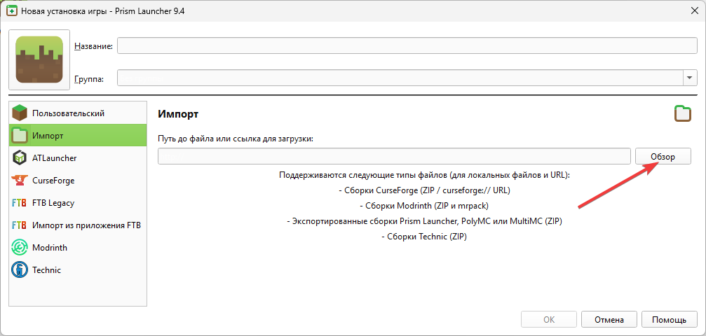
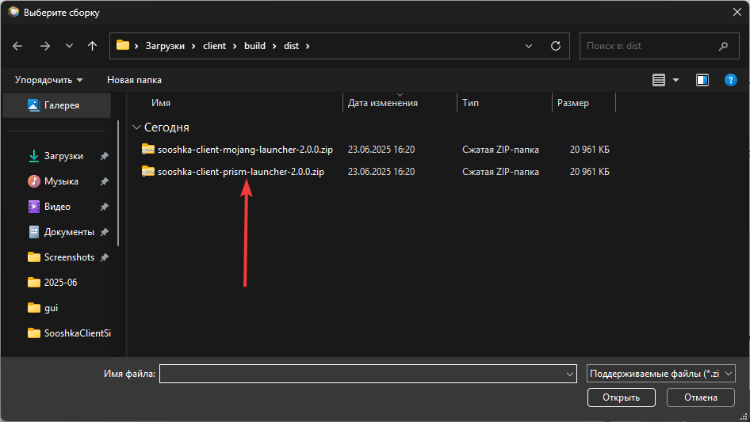
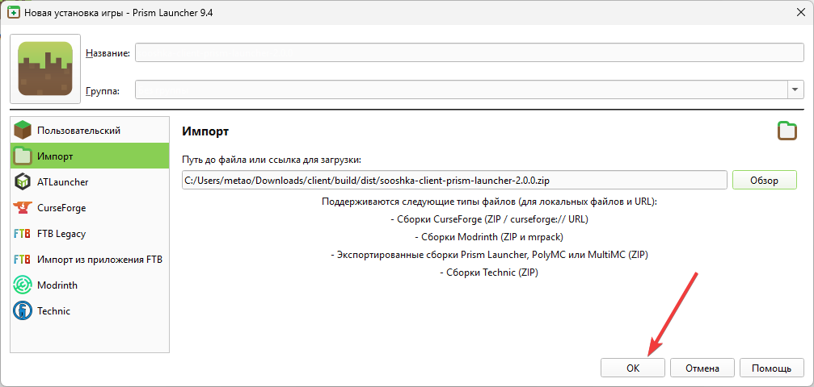
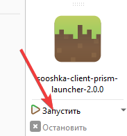

# Sooshka Client 

Добро пожаловать на страницу Sooshka Client! Это модифицированный клиент, основанный на популярном SolClient и созданный с целью улучшить ваш игровой опыт.

## 🚀 Как установить

1.  **Добавить сборку.**  
    *В вашем лаунчере нажмите на кнопку добавления новой сборки/версии.*
    

2.  **Выбрать 'Импорт'.**  
    *В появившемся окне выберите опцию импорта.*
    

3.  **Нажать 'Обзор'.**  
    *Найдите и нажмите кнопку для обзора файлов на вашем компьютере.*
    

4.  **Выбрать скачанную сборку.**  
    *Найдите и выберите скачанный файл Sooshka Client (обычно с расширением `.zip` или `.jar`).*
    

5.  **Нажать 'ОК'.**  
    *Подтвердите свой выбор.*
    

6.  **Готово! Запускаем клиент.**  
    *Теперь вы можете выбрать Sooshka Client из списка версий и запустить игру.*
    

*Примечание: для корректного отображения скриншотов убедитесь, что папки `icon` и `assets` находятся в корне вашего репозитория.*

## 👤 Создатель

Проект разработан и поддерживается **Sooshka**. 